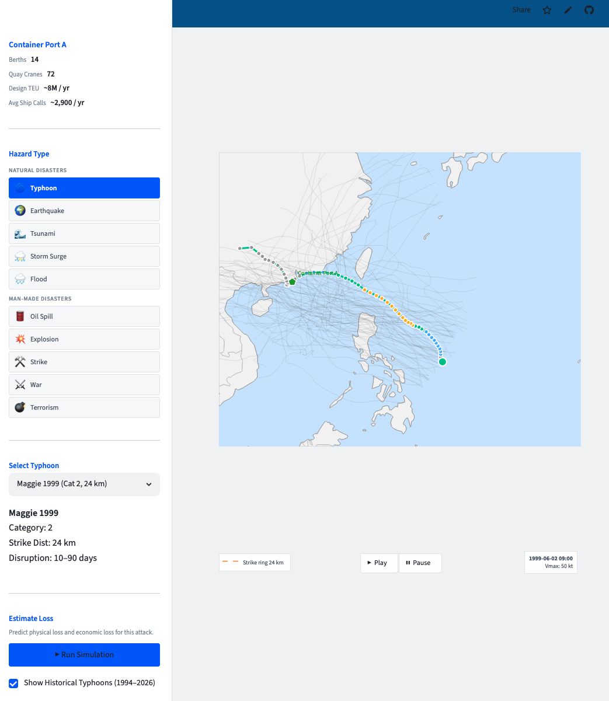

# Port Typhoon Risk Simulator

[](https://github.com/juanita-cao/port-typhoon-simulator/actions/workflows/test.yml)


**[Live demo →](https://port-typhoon-simulator.streamlit.app/)**

A discrete-event simulation dashboard for estimating typhoon-induced container-port throughput loss.

Given a port configuration and a typhoon scenario, the system simulates disrupted port operations, estimates physical and economic loss, and writes reproducible statistical artifacts for review. **The data is synthetic** — see [Data note](#data-note) below.

This project uses a contract-first simulation workflow — schemas before logic, validation separate from result interpretation, and reproducible artifacts for every run.

---

## Demo Preview



---

## What this demonstrates

- **Contract-first pipeline design** — each step has explicit Pydantic input/output schemas, so malformed values fail at the boundary instead of propagating downstream.
- **Discrete-event simulation under disruption** — SimPy models port operations under typhoon-induced capacity loss.
- **Statistical V&V** — Welch's warm-up method, Kelton's (2002) replication-sizing formula, common random numbers, paired t-tests, and Holm-Bonferroni correction.
- **Decision-oriented output** — separates statistical significance (p-value) from operationally meaningful loss (effect size), because they answer different questions.
- **Reproducible artifacts** — each run persists raw outputs, the comparison table, V&V reports, and a human-readable summary.
- **Design-before-code workflow** — the three documents in [`docs/`](docs/) were written before the corresponding implementation, each reviewed before the next was built on top of it.

---

## Architecture

```
IBTrACS data ──► load typhoon data ──► run simulation ──► physical loss ──┐
                                            (SimPy DES)         (Monte Carlo)  │
                                                                              ▼
                                                                    economic loss ──► aggregate losses
                                                                                              │
                                                                                              ▼
                                                                                      Streamlit + map UI
```

Design documents:
- [`docs/design_backend.md`](docs/design_backend.md) — pipeline table, data contracts, sequence diagrams
- [`docs/design_simulation.md`](docs/design_simulation.md) — entity model, distribution fitting, replication plan, V&V
- [`docs/design_frontend.md`](docs/design_frontend.md) — state machine, ViewModel, screen flow

---

## Quickstart

```bash
git clone https://github.com/juanita-cao/port-typhoon-simulator.git
cd port-typhoon-simulator
python -m venv .venv
source .venv/bin/activate
pip install -r requirements.txt

# run the test suite (79 tests: distributions, CRN stream independence,
# replication-count formula, schema validation, IBTrACS classification)
pytest tests/ -v

# lint
ruff check .

# launch the UI
streamlit run src/app_streamlit.py

# or run the full 26-scenario pipeline from the command line
python -c "from backend.pipeline import run_full_pipeline; run_full_pipeline(verbose=True)"
```

Requires Python 3.11+ (uses `X | Y` union type syntax evaluated at runtime by Pydantic).

CI runs the same lint + test commands on every push — see [`.github/workflows/test.yml`](.github/workflows/test.yml).

---

## Data note

A prior internal version was calibrated with non-redistributable terminal operation data. This public version generates a **synthetic vessel-call log** (`scripts/generate_synthetic_demo_data.py`) with the same column structure and a similar order of magnitude, then runs it through the same distribution-fitting pipeline (`build_processed_data.py` → `fit_input_distributions.py`) that the original used. The port itself ("NPT") and its berth/crane counts are illustrative, not a real terminal's specs. The validation benchmark in `verification_validation.py` is likewise an illustrative reference value, calibrated to exercise the same pass/fail logic a real validation would use.

The public version preserves the same engineering structure: pipeline architecture, schemas, statistical workflow, validation checks, and tests. Only the non-redistributable operational data and identifying terminal details have been replaced.

The typhoon track data (IBTrACS) is a real, public meteorological dataset and is used as-is.

---

## Project structure

```
data/             synthetic vessel-call log, fitted distributions, public IBTrACS typhoon tracks
docs/             design documents (read before the corresponding code was written)
scripts/          one-off data generation / fitting / preprocessing scripts
src/backend/      pipeline steps, schemas, SimPy simulation, statistics, artifact persistence
src/frontend/     Streamlit state machine and view models
src/app_streamlit.py   the UI entry point
tests/            79 tests covering distributions, replication, output analysis, IBTrACS classification
```

---

## Current Scope

Implemented:
- IBTrACS typhoon parsing and scenario classification
- SimPy port-disruption simulation
- Physical and economic loss estimation
- Statistical verification/validation checks
- Streamlit single-scenario UI
- Reproducible artifact export

Not implemented:
- Earthquake / tsunami / other hazard types — the sidebar shows them greyed out (not clickable) to indicate the data model was designed to extend beyond typhoon, not as a roadmap commitment
- Production-grade calibration against confidential terminal records
- Multi-user authentication or persistent cloud storage

Per-step implementation status: `docs/design_backend.md` §9, `docs/design_frontend.md` §12, `docs/design_simulation.md` §8.
